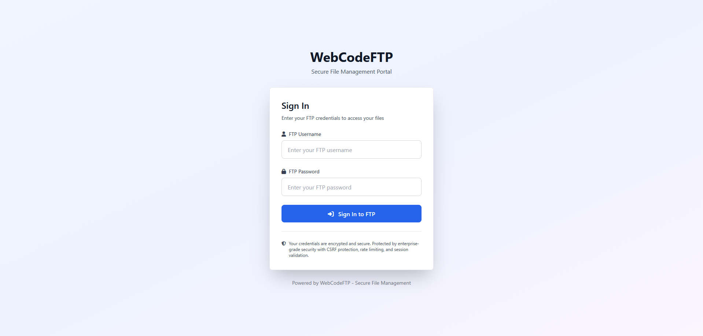
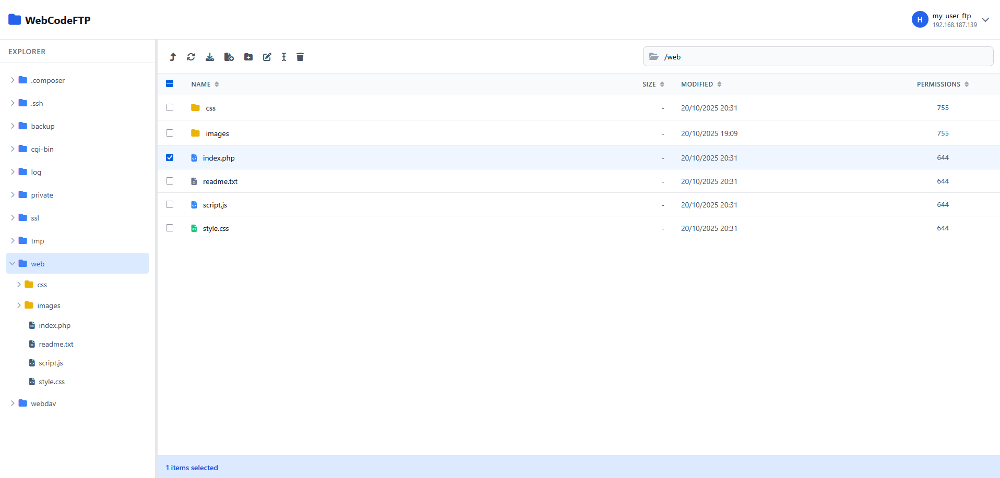
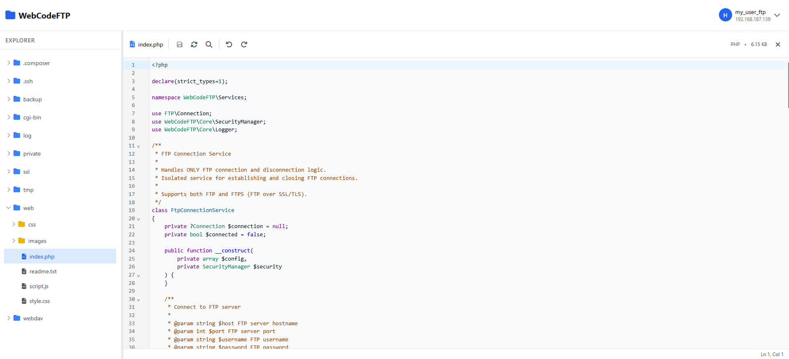

# WebCodeFTP

> 🚀 Modern web-based FTP client with integrated CodeMirror 6 editor

[](LICENSE)
[](https://www.php.net/)
[](https://codemirror.net/)

**Edit your server code files directly in the browser with powerful syntax highlighting for 50+ programming languages.**

---

## ☕ Support This Project

**Enjoying WebCodeFTP?** Your support helps maintain the website, documentation, and keep this project alive!

[](https://github.com/sponsors/codebyoul)
[](https://www.paypal.com/donate/?hosted_button_id=5AX5S82LDZQ8N)

**Any contribution is greatly appreciated** — it helps cover hosting costs, documentation, and future development. Thank you! 🙏

---

## ✨ Features

- 🎨 **Integrated Code Editor** - CodeMirror 6 with syntax highlighting for 50+ languages
- 🔒 **Enterprise Security** - CSRF protection, session security, rate limiting, SSRF prevention
- 🌍 **Multi-Language** - 7 languages supported (English, French, Spanish, German, Italian, Portuguese, Arabic)
- 🎨 **Dark/Light Theme** - Automatic theme switching with user preference
- 📁 **File Manager** - Browse, create, rename, delete files and folders
- ⚡ **Fast & Lightweight** - PHP 8.0+ with zero backend dependencies
- 🔐 **SSH Support** - Advanced operations (zip, unzip, move) via SSH for better performance

---

## 📸 Screenshots

### Login Page


### File Manager


### Integrated Code Editor


---

## 🚀 Quick Start

### Requirements

- **PHP 8.0+** (8.0, 8.1, 8.2, 8.3)
- **Composer** (for dependency management)
- **PHP Extensions:**
  - `ftp` (for FTP connections)
  - `session` (for session management)
  - `zlib` (optional - for compression)
- **Required Package:**
  - `phpseclib/phpseclib` ^3.0.7 (for SSH operations)
- **Web Server:** Apache with mod_rewrite OR Nginx
- **HTTPS** recommended for production

### Installation

```bash
# 1. Clone the repository
git clone https://github.com/codebyoul/webcodeftp.git
cd webcodeftp

# 2. Install dependencies (REQUIRED)
composer install

# 3. Configure your FTP server
nano config/config.php

# 4. Set permissions
chmod 755 logs/
chmod 644 config/config.php

# 5. Point your web server document root to public/
# Apache example:
# DocumentRoot /path/to/webcodeftp/public
```

### Web Server Configuration

**Apache** (create VirtualHost):
```apache
<VirtualHost *:80>
    ServerName ftp.example.com
    DocumentRoot /path/to/webcodeftp/public

    <Directory /path/to/webcodeftp/public>
        AllowOverride All
        Require all granted
    </Directory>
</VirtualHost>
```

**Nginx**:
```nginx
server {
    listen 80;
    server_name ftp.example.com;
    root /path/to/webcodeftp/public;
    index index.php;

    location / {
        try_files $uri $uri/ /index.php?$query_string;
    }

    location ~ \.php$ {
        fastcgi_pass unix:/var/run/php/php-fpm.sock;
        fastcgi_index index.php;
        include fastcgi_params;
        fastcgi_param SCRIPT_FILENAME $document_root$fastcgi_script_name;
    }
}
```

---

## ⚙️ Configuration File

WebCodeFTP uses a **single configuration file** at `config/config.php`. This is where you configure:

### 1. FTP Server Settings

```php
'ftp' => [
    'server' => [
        'host' => 'ftp.example.com',  // YOUR FTP server hostname/IP
        'port' => 21,                  // FTP port (21 for FTP, 990 for FTPS)
        'use_ssl' => false,            // Enable FTPS if supported
        'passive_mode' => true,        // Recommended
    ],
    'timeout' => 30,
    'operation_timeout' => 120,
],
```

**Security Note:** Users can ONLY connect to your configured FTP server. They cannot specify custom servers, preventing SSRF attacks.

### 2. SSH Configuration (Optional - Recommended)

**SSH operations powered by [phpseclib](https://github.com/phpseclib/phpseclib) 3.0.7** - A pure PHP SSH implementation.

**Why use SSH over FTP?** SSH provides **significantly better performance** for advanced operations:

| Operation | FTP Method | SSH Method | Performance |
|-----------|------------|------------|-------------|
| **Zip Files** | Download all → Zip locally → Upload | Direct server-side zip | **10-100x faster** |
| **Unzip Files** | Download → Unzip locally → Upload all | Direct server-side unzip | **10-100x faster** |
| **Move Files** | Download → Upload to new location → Delete old | Direct server-side move | **Instant** |
| **Delete Large Folders** | Delete each file individually | Single command | **100x faster** |

**Enable SSH in config:**

```php
'ssh' => [
    'enabled' => true,  // Enable SSH features

    'server' => [
        'host' => 'ssh.example.com',  // SSH server (usually same as FTP)
        'port' => 22,
    ],

    'credentials' => [
        'username' => 'your_ssh_username',  // SSH credentials
        'password' => 'your_ssh_password',  // (different from FTP)
    ],
],
```

**Benefits:**
- ✅ **10-100x faster** for zip/unzip operations
- ✅ **Instant** file/folder moves (no download/upload)
- ✅ **Batch operations** complete in seconds
- ✅ **Server-side processing** - no bandwidth waste

### 3. Security Settings

```php
'security' => [
    'session' => [
        'lifetime' => 3600,        // 1 hour
        'cookie_secure' => true,   // Require HTTPS
    ],
    'rate_limit' => [
        'max_attempts' => 5,       // Failed login attempts
        'lockout_duration' => 900, // 15 minutes
    ],
],
```

### 4. UI Preferences

```php
'ui' => [
    'default_theme' => 'dark',  // 'light' or 'dark'
],

'localization' => [
    'default_language' => 'en',  // en, fr, es, de, it, pt, ar
],
```

---

## 🎨 Supported Languages (Syntax Highlighting)

PHP, JavaScript, TypeScript, HTML, CSS, Python, Java, C, C++, Go, Rust, Ruby, Swift, Kotlin, Scala, SQL, JSON, XML, YAML, Markdown, **and 30+ more!**

---

## 🔒 Security Features

- ✅ **CSRF Protection** - Secure tokens on all forms
- ✅ **Session Security** - Fingerprinting, IP validation, automatic timeout
- ✅ **Rate Limiting** - Brute force protection (5 attempts → 15 min lockout)
- ✅ **SSRF Prevention** - Single configured FTP server only
- ✅ **Input Validation** - All user input sanitized
- ✅ **Path Traversal Protection** - Prevents directory escape attacks
- ✅ **Security Headers** - CSP, X-Frame-Options, X-XSS-Protection
- ✅ **No Credential Storage** - FTP passwords never logged or stored

---

## 📄 License

MIT License - Copyright (c) 2025

Permission is hereby granted, free of charge, to any person obtaining a copy of this software and associated documentation files (the "Software"), to deal in the Software without restriction, including without limitation the rights to use, copy, modify, merge, publish, distribute, sublicense, and/or sell copies of the Software, and to permit persons to whom the Software is furnished to do so, subject to the following conditions:

The above copyright notice and this permission notice shall be included in all copies or substantial portions of the Software.

**Legal Use Restriction**: This software must not be used for any illegal activities or illegal content. Such use is strictly prohibited and will result in immediate termination of the license.

THE SOFTWARE IS PROVIDED "AS IS", WITHOUT WARRANTY OF ANY KIND, EXPRESS OR IMPLIED, INCLUDING BUT NOT LIMITED TO THE WARRANTIES OF MERCHANTABILITY, FITNESS FOR A PARTICULAR PURPOSE AND NONINFRINGEMENT. IN NO EVENT SHALL THE AUTHORS OR COPYRIGHT HOLDERS BE LIABLE FOR ANY CLAIM, DAMAGES OR OTHER LIABILITY, WHETHER IN AN ACTION OF CONTRACT, TORT OR OTHERWISE, ARISING FROM, OUT OF OR IN CONNECTION WITH THE SOFTWARE OR THE USE OR OTHER DEALINGS IN THE SOFTWARE.

---

## 🙏 Acknowledgments

Built with amazing open-source technologies:

- [CodeMirror 6](https://codemirror.net/) - The powerful code editor
- [phpseclib 3.0.7](https://github.com/phpseclib/phpseclib) - Pure PHP SSH implementation
- [Tailwind CSS](https://tailwindcss.com/) - Utility-first CSS framework
- [Font Awesome](https://fontawesome.com/) - Beautiful icons
- PHP 8.0+ - Modern, fast, and secure

---

## ☕ Support & Contribute

**Love WebCodeFTP?** Help keep this project alive and growing!

### Ways to Support:

- ⭐ **Star this repository** - Show your appreciation!
- 💖 **[GitHub Sponsors](https://github.com/sponsors/codebyoul)** - Support ongoing development
- 💳 **[PayPal](https://www.paypal.com/donate/?hosted_button_id=5AX5S82LDZQ8N)** - One-time or recurring donations
- 🐛 **Report Bugs** - Open issues on GitHub
- 💡 **Suggest Features** - We love new ideas!
- 🔧 **Contribute Code** - Pull requests welcome!

**Your support makes a real difference!** It helps cover:
- 🌐 Website hosting costs
- 📚 Documentation maintenance
- 🚀 New feature development
- 🐛 Bug fixes and improvements
- 💬 Community support

**Thank you for being awesome!** 🙏

---

**Built with PHP 8.0+ & CodeMirror 6 | Secure by Design | Lightning Fast | Code Anywhere** 🚀
